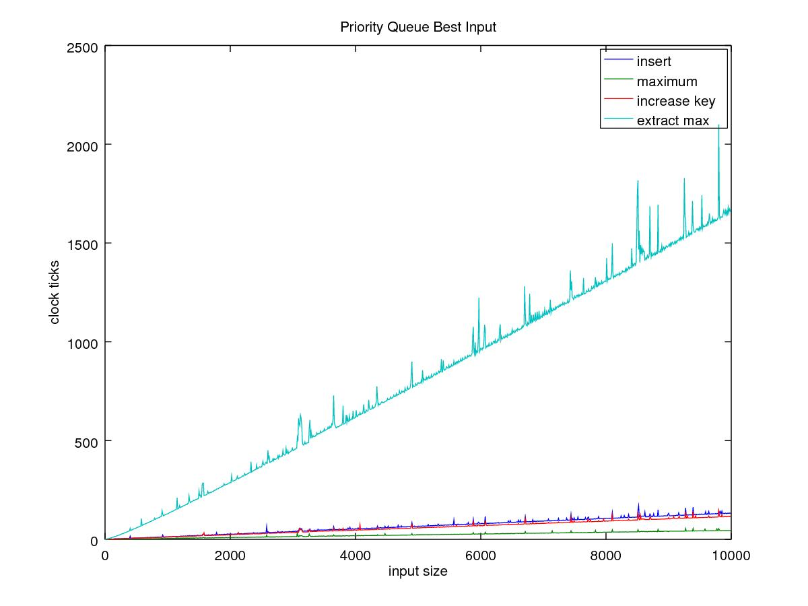

% Hermes Espínola González
% February 24, 2017
% Homework 2

1. Indicator Variable Exercises

    5.4-1: How many people must there be in a room before the probability that
          someone has the same birthday as you do is at least 1/2?

      Beign $n$ the number of days in a year and $k$ the number of people in
      the room, the probability of a person not having the same birthday as
      I do is:
      $$ \frac{n-1}{n} $$
      And the probability of k persons **not** having the same birthday is as
      I do is:
      $$ (\frac{n-1}{n})^k $$
      Then we can show that:
      $$ 1 - (\frac{n-1}{n})^k \geq \frac{1}{2} $$
      $$ (\frac{n-1}{n})^k \leq \frac{1}{2} $$
      $$ klog(n-1)log(n) \leq \frac{1}{2} $$
      $$ k = \frac{log(0.5)}{log(\frac{364}{365})} \approx 263 $$

    5.4-6: How many people must there be for the probability that at least
          2 people have a birthday on *July 4* is $> 1/2$?

      $$ {k \choose 1}(\frac{1}{365})(\frac{354}{365})^{k-1}-{k \choose 0}
      (\frac{364}{365})^k $$
      $$ \therefore k \geq 613 $$

2. Priority Queue

    Implement the Max Priority Queue using a Max-Heap with all the operations
    described using the programming language C++. Then using the clock ticks,
    prove that the complexities described in the Cormen’s book are correct by
    using adequate scales and plots.

    _**Find the code in the priorityQueue directory.**_

    
    Worst

    
    Best

    
    Random

3. Linear Sorting

    - Bucket Sort:
        + ***Find the code in linearSorting/src/BucketSort.cpp***

        

    - Radix Sort:
        + ***Find the code in linearSorting/src/RadixSort.cpp***

        

4. Hash Tables

    Implement the Hash table using link list as collision policy, then test the
    complexity $O (1 + \alpha)$ for successful or unsuccessful search of the table
    using a correct range. For the hash table test the following hash functions:

      i. Universal Hashing using the Random Matrix (using the bit counting idea).
      ii. The Division Method.
      iii. The Multiplication Method using the computer implementation.

      ***Find the code in the directory hashTable***
